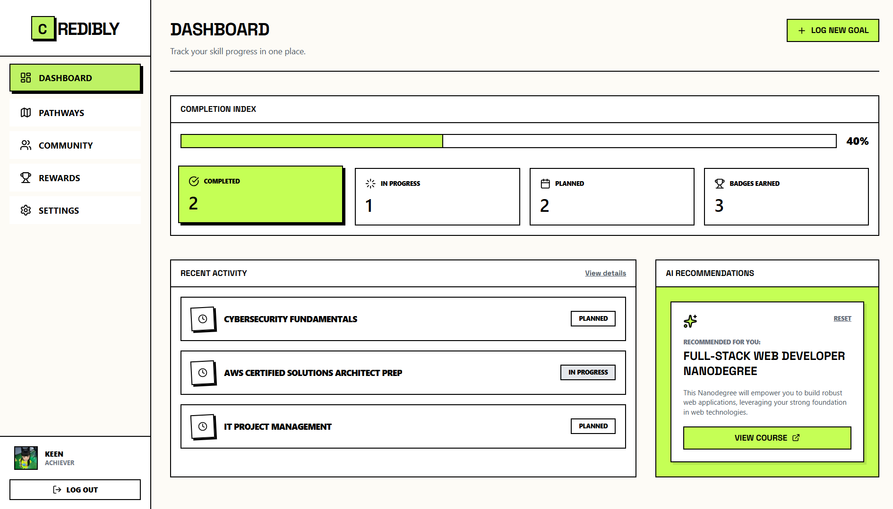
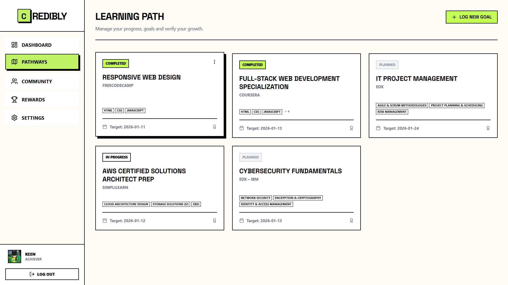
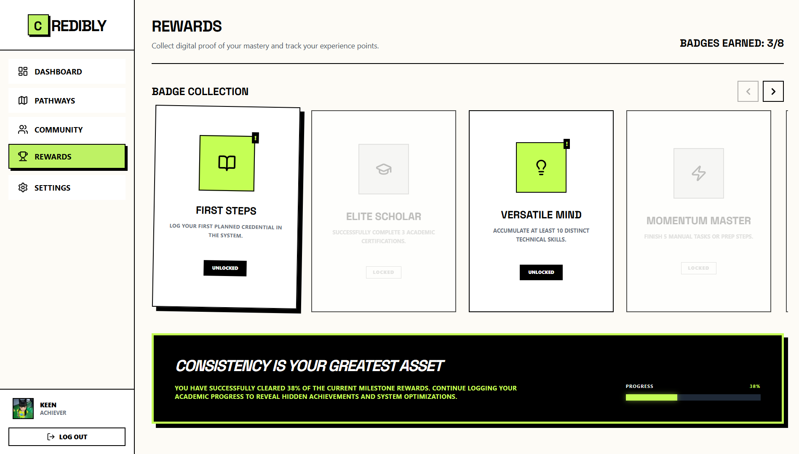
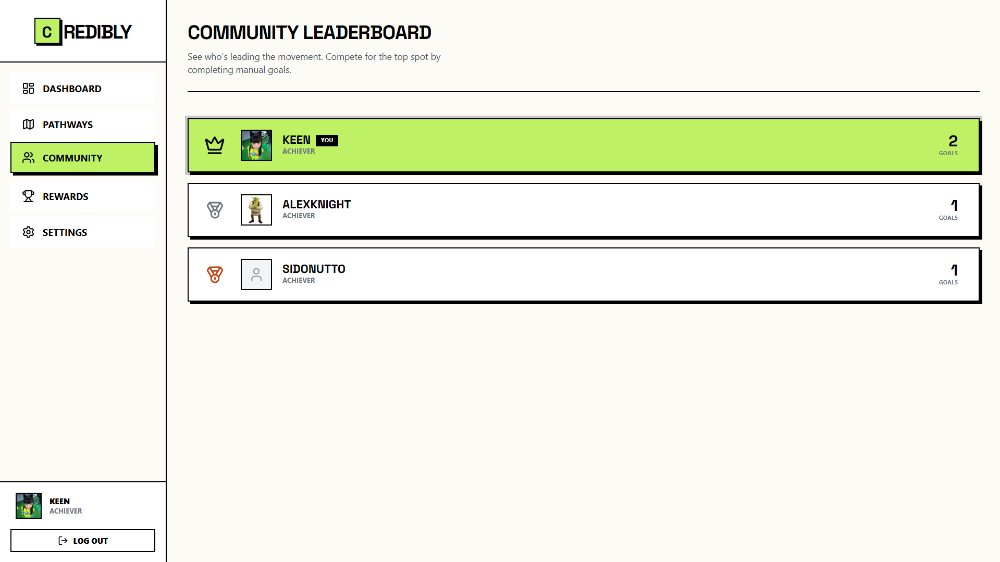

<br />
<div align="center">
  <a href="https://github.com/aikeen8/credibly">
    
  </a>

  <h1 align="center">Credibly</h1>

  <p align="center">
    A dedicated achievement tracker designed to help self-learners organize scattered certifications, overcome analysis paralysis, and actually finish the courses they start.
    <br />
    <br />
    <a href="https://credibly-snowy.vercel.app"><strong>View Live Demo »</strong></a>
    <br />
    <br />
    <a href="https://github.com/aikeen8/credibly/issues">Report Bug</a>
    ·
    <a href="https://github.com/aikeen8/credibly/issues">Request Feature</a>
  </p>
</div>

## About The Project

Credibly was built to assist self-learners who value continuous improvement but frequently encounter three specific challenges:

1.  **Scattered Achievements:** Completing courses on different platforms (like YouTube, Udemy, or Coursera) often leads to **disorganization**. Because there is no single place to view them all, it is easy to forget past accomplishments.
2.  **Lack of Focus:** With so many topics to learn, it is difficult to decide what to prioritize. Learners often start multiple courses at once but struggle to finish them, resulting in many "In Progress" projects but few "Completed" ones.
3.  **Loss of Motivation:** Self-paced learning lacks the immediate rewards found in schools or games. Without a clear feedback system, it is easy to lose interest when a course becomes difficult.

**Credibly addresses these issues by serving as:**
* **A Unified Record:** A single dashboard to track every certificate and badge, regardless of where it was earned.
* **A Commitment Tool:** By manually logging goals, the system encourages users to focus on one objective at a time.
* **A Gamified System:** It uses badges, levels, and leaderboards to provide visual progress and keep users engaged.

## Table Of Contents

1. [About The Project](#about-the-project)
    * [Features](#features)
    * [Technologies Used](#technologies-used)
2. [Application Snapshots](#application-snapshots)
3. [Installation](#installation)
    * [Prerequisites](#prerequisites)
4. [Run](#run)

### Features

* **Smart Goal Tracking:** Organize learning paths into Planned, In Progress, and Completed statuses with a visual Kanban-style workflow.
* **AI-Powered Recommendations:** Integrated with **Google Gemini AI** to suggest relevant courses, skills, and roadmaps based on user goals.
* **Gamification System:** Dynamic badge system that awards users for consistency ("Consistency King") and milestones ("First Steps").
* **Interactive Dashboard:** Provides real-time visual analytics of completion rates and recent activities.
* **Community Leaderboard:** A ranking system to foster healthy competition among learners.
* **Secure Authentication:** Custom JWT-based authentication system with protected routes.

### Technologies Used

**Frontend**
* React
* TypeScript
* Tailwind CSS

**Backend**
* Node.js
* Express.js
* MongoDB

**AI & Services**
* Google Gemini API

## Application Snapshots

| **Dashboard** | **Pathways** |
|:---:|:---:|
| |  |

| **Rewards System** | **Community Leaderboard** |
|:---:|:---:|
|  |  |

## Installation

To get a local copy up and running, follow these simple steps.

### Prerequisites

* Node.js (v14 or higher)
* npm
    ```sh
    npm install npm@latest -g
    ```
* MongoDB URI (Local or Atlas)
* Google Gemini API Key

### Setup

1.  **Clone the repo**
    ```sh
    git clone [https://github.com/aikeen8/credibly.git](https://github.com/aikeen8/credibly.git)
    ```
2.  **Install Dependencies (Root, Client, & Server)**
    ```sh
    npm install
    cd client && npm install
    cd ../server && npm install
    ```
3.  **Configure Environment Variables**
    Create a `.env` file in the `server` directory:
    ```env
    PORT=5000
    MONGODB_URI=your_mongodb_connection_string
    JWT_SECRET=your_jwt_secret_key
    GEMINI_API_KEY=your_google_gemini_api_key
    ```

## Run

Start the development servers (Run both client and server):

```sh
# In the root directory (if concurrent is set up)
npm run dev

# OR manually:
# Terminal 1 (Server)
cd server
npm run dev

# Terminal 2 (Client)
cd client
npm run dev
